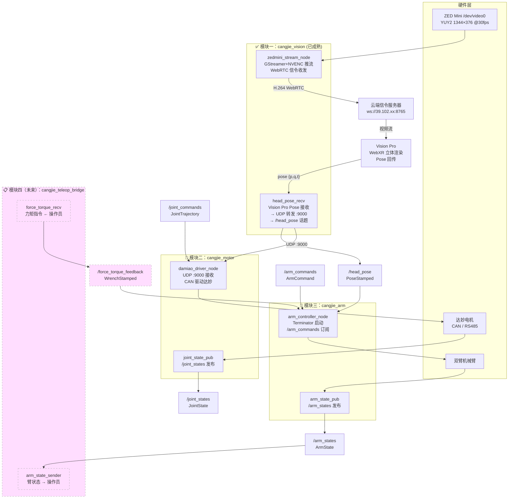

# 仓颉·具身智能遥操系统 (Cangjie-Embodied)
## 整体系统拓扑图 v0.2

> **系统定位**：基于 ROS 2 框架 + 实时操作系统（RT Linux/Preempt-RT）的具身智能双臂遥操系统，
> 实现操作员对远端机器人的实时低延迟遥操控制。
>
> **当前状态总览**：
> - ✅ 模块一（视觉推流引擎）：**已成熟可用**，ZED Mini → WebRTC → Vision Pro 完整链路跑通
> - ✅ 推流引擎内嵌 Pose 回传接收 + UDP 转发至达妙电机端口（`127.0.0.1:9000`）
> - 🔲 模块二（达妙电机 ROS 2 节点）：待开发（UDP 接收侧需独立为 rclpy 节点）
> - 🔲 模块三（双臂控制）：待开发
> - 📋 模块四（双向遥操桥接）：规划中

---

## 一、系统总体架构

```
╔══════════════════════════════════════════════════════════════════════════════╗
║                    CANGJIE-EMBODIED  仓颉·具身遥操系统                        ║
╠══════════════════════════════╦═══════════════════════════════════════════════╣
║     操作员侧  (Operator)      ║              机器人侧  (Robot)                 ║
║  ─────────────────────────  ║  ──────────────────────────────────────────── ║
║  ┌────────────────────────┐  ║  ┌───────────────────────────────────────┐   ║
║  │  Apple Vision Pro      │  ║  │    实时操作系统  RT Linux              │   ║
║  │  ✅ WebXR 立体渲染      │  ║  │    (Preempt-RT Kernel Patch)          │   ║
║  │     左眼←左半画面       │  ║  ├───────────────────────────────────────┤   ║
║  │     右眼←右半画面       │  ║  │    ROS 2 中间件层 (DDS / rmw)         │   ║
║  │  ✅ 头部姿态追踪         │  ║  ├─────────────┬────────────┬───────────┤   ║
║  │     → pose 数据回传     │  ║  │ ✅ 视觉推流  │ 🔲 电机    │ 🔲 双臂  │   ║
║  └──────────┬─────────────┘  ║  │  cangjie_   │ cangjie_   │ cangjie_ │   ║
║             │ WebSocket pose  ║  │  vision     │ motor      │ arm      │   ║
║             ▼                 ║  ├─────────────┴────────────┴───────────┤   ║
║  ┌────────────────────────┐  ║  │  📋 [Future] cangjie_teleop_bridge   │   ║
║  │  [Future] 力反馈手柄   │  ║  └───────────────────────────────────────┘   ║
║  │  力矩指令输出           │  ║                                               ║
║  └────────────┬───────────┘  ║                                               ║
╚═══════════════╬══════════════╩═══════════════════════════════════════════════╝
                ║
                ║  公网通信层（WebRTC + WebSocket）
                ║  ┌─────────────────────────────────┐
                ╚══╣  云端信令服务器 ws://39.102.xx:8765  ╠══╗
                   │  TURN 中继服务器 (coturn :3478)    │  ║
                   └─────────────────────────────────┘  ║
                                                         ║ WebRTC H.264
                                            ╔════════════╝
                                            ║ 机器人侧 ZED Mini 推流
                                            ▼
                               ✅ 1344×376 side-by-side 30fps 3000kbps
```

---

## 二、机器人侧内部数据流（当前实际架构）

```
┌─────────────────────────────────────────────────────────────────────────┐
│                        机器人侧 (Ubuntu + RT Linux)                      │
│                                                                         │
│  ┌──────────────────────────────────────────────────────────────────┐   │
│  │         ✅ 模块一：视觉推流引擎  zedmini_webrtc_sender.py          │   │
│  │                                                                  │   │
│  │  /dev/video0 (ZED Mini, YUY2 1344×376)                          │   │
│  │        │                                                         │   │
│  │        ▼ GStreamer v4l2src                                       │   │
│  │  [videoconvert → nvh264enc(NVENC) → rtph264pay]                 │   │
│  │        │                                                         │   │
│  │        ▼ WebRTC (GstWebRTC)                                      │   │
│  │  ─────────────────────────────────────────────►  Vision Pro      │   │
│  │        视频推流 H.264 3000kbps 30fps ~100ms延迟                    │   │
│  │                                                                  │   │
│  │  Vision Pro ──── pose {p, q, t} ────────────────► WebSocket ─► │   │
│  │        │  收到头部姿态 (position + quaternion)                    │   │
│  │        │                                                         │   │
│  │        ├─► quat_to_euler → (yaw, pitch, roll)                   │   │
│  │        │       │                                                 │   │
│  │        │       ├─► MotorController.on_pose()                    │   │
│  │        │       │     [dummy / serial / CAN 三种模式]              │   │
│  │        │       │                                                 │   │
│  │        │       └─► UDP sendto 127.0.0.1:9000  ─────────────────►│   │
│  │        │               (JSON: roll/pitch/yaw/pos/quat/t)        │   │
│  └──────────────────────────────────────────────────────────────────┘   │
│                                              │ UDP :9000                 │
│                                              ▼                           │
│  ┌───────────────────────────────────────────────────────────────────┐  │
│  │  🔲 模块二：达妙电机 ROS 2 节点  cangjie_motor                     │  │
│  │                                                                   │  │
│  │  UDP Listener :9000                                               │  │
│  │        │  接收 pose JSON                                          │  │
│  │        ▼                                                          │  │
│  │  damiao_driver_node (rclpy)                                       │  │
│  │        │ 发布 /joint_states                                       │  │
│  │        │ 订阅 /joint_commands                                     │  │
│  │        ▼ CAN / RS485                                              │  │
│  │  达妙电机硬件 (颈部云台 / 其他关节)                                  │  │
│  └───────────────────────────────────────────────────────────────────┘  │
│                                                                         │
│  ┌───────────────────────────────────────────────────────────────────┐  │
│  │  🔲 模块三：双臂控制  cangjie_arm                                  │  │
│  │                                                                   │  │
│  │  arm_controller_node (rclpy)                                      │  │
│  │        │ 由 Terminator 命令启动                                    │  │
│  │        │ 订阅 /arm_commands                                       │  │
│  │        │ 发布 /arm_states                                         │  │
│  │        ▼                                                          │  │
│  │  双臂机械臂硬件                                                     │  │
│  └───────────────────────────────────────────────────────────────────┘  │
│                                                                         │
│  ┌───────────────────────────────────────────────────────────────────┐  │
│  │  📋 模块四（未来）：双向遥操桥接  cangjie_teleop_bridge               │  │
│  │                                                                   │  │
│  │  → 发送：当前臂状态 /arm_states → 操作员侧（显示 / 力反馈计算）        │  │
│  │  ← 接收：操作员力矩指令 → /force_torque_feedback → 臂控制器          │  │
│  └───────────────────────────────────────────────────────────────────┘  │
└─────────────────────────────────────────────────────────────────────────┘
```

---

## 三、ROS 2 节点拓扑图（目标态）



> 虚线框/节点表示**未来规划**功能，尚未实现。

---

## 四、模块详细说明

### 模块一：视觉推流引擎 `cangjie_vision` ✅ 已成熟

| 属性 | 内容 |
|------|------|
| **硬件** | ZED Mini（ZED M 系列），`/dev/video0`，原生 side-by-side 输出 |
| **当前状态** | ✅ **生产可用**，完整链路已跑通 |
| **视频规格** | 1344×376 YUY2 @30fps → NVENC H.264 CBR 3000kbps |
| **接收端** | Apple Vision Pro（WebXR，左右眼 UV 分割立体渲染） |
| **Pose 回传** | Vision Pro → WebSocket → 接收 `{p, q, t}` → quat_to_euler |
| **电机联动** | Pose → `MotorController.on_pose()` + UDP 转发 `127.0.0.1:9000` |
| **电机模式** | `dummy` / `serial`（`/dev/ttyUSB0`）/ `can`（`can0`）可切换 |
| **延迟实测** | ~100ms 端到端（公网 TURN 中继） |
| **关键依赖** | GStreamer 1.0, NVIDIA NVENC, Python websockets, GstWebRTC |
| **现有代码** | `scripts/20260330-cc-zedmini_webrtc_sender.py`（600行）<br/>`scripts/20260330-cc-visionpro_stereo_receiver.html`（870行） |

**待集成工作（ROS 2 化）：**
- [ ] 将推流引擎封装为 rclpy 节点（保持现有逻辑不变，加 spin）
- [ ] 将接收到的 head pose 发布到 `/head_pose` 话题（供其他节点订阅）
- [ ] 将 UDP 转发改为直接发布 `/head_pose`（或并行保留 UDP 兼容旧代码）

---

### 模块二：达妙电机控制模块 `cangjie_motor` 🔲 待开发

| 属性 | 内容 |
|------|------|
| **硬件** | 达妙（Damiao）系列电机 |
| **当前状态** | 🔲 待开发（推流引擎已有 stub，需独立为 ROS 2 节点） |
| **数据来源** | UDP `:9000` 接收来自推流引擎的 pose JSON |
| **通信协议** | CAN 总线（`can0`）/ RS485 串口（`/dev/ttyUSB0`） |
| **核心功能** | 电机驱动、关节状态读取、力矩/位置控制 |
| **输入** | UDP `:9000`（pose）+ `/joint_commands`（关节轨迹指令） |
| **输出** | `/joint_states`（关节角度、速度、力矩） |
| **控制模式** | 位置模式 / 速度模式 / MIT 力矩模式 |
| **实时要求** | 控制周期 ≤ 1ms（需 RT 内核支持） |

**待完成工作：**
- [ ] 从推流引擎中剥离 `SerialMotorController` / `CANMotorController` 代码
- [ ] 封装为独立 rclpy 节点，监听 UDP :9000 并订阅 `/joint_commands`
- [ ] 发布 `/joint_states` 话题
- [ ] 实现电机使能/失能安全机制，添加过载过温保护

---

### 模块三：双臂控制模块 `cangjie_arm`

| 属性 | 内容 |
|------|------|
| **硬件** | 双臂机械臂（具体型号 TBD） |
| **当前状态** | 🔲 待开发 |
| **启动方式** | `terminator` 命令启动控制器进程 |
| **核心功能** | 双臂运动学、笛卡尔/关节空间控制 |
| **输入** | `/arm_commands`（目标位姿/关节角） |
| **输出** | `/arm_states`（当前末端位姿 + 关节状态） |
| **规划器** | MoveIt 2 / 自定义控制器 |

**待完成工作：**
- [ ] 封装 Terminator 启动逻辑为 launch 文件
- [ ] 定义 `cangjie_msgs/ArmState` 和 `ArmCommand` 消息类型
- [ ] 实现双臂协同控制逻辑
- [ ] 添加碰撞检测和安全停止

---

### 模块四（未来）：遥操桥接模块 `cangjie_teleop_bridge`

| 属性 | 内容 |
|------|------|
| **当前状态** | 📋 规划中 |
| **功能 A** | 发送当前机械臂状态 → 操作员侧（双向状态同步） |
| **功能 B** | 接收从外部传回的力矩信息 → 发布到 `/force_torque_feedback` |
| **通信方式** | WebSocket / WebRTC DataChannel |
| **话题** | 发布 `/force_torque_feedback`（`geometry_msgs/WrenchStamped`） |

---

## 四、系统目录结构规划

```
Cangjie-Embodied/
│
├── 20260331-cc-system_topology.md        ← 本文件（系统拓扑总览）
│
├── cangjie_vision/                        # 模块一：视觉推流
│   ├── cangjie_vision/                    # Python 包
│   │   ├── __init__.py
│   │   ├── stereo_capture_node.py         # 双目采集节点
│   │   ├── webrtc_stream_node.py          # WebRTC 推流节点
│   │   └── head_pose_sub_node.py          # 头部姿态订阅节点
│   ├── package.xml
│   ├── setup.py
│   └── config/
│       └── stream_params.yaml
│
├── cangjie_motor/                         # 模块二：达妙电机控制
│   ├── cangjie_motor/
│   │   ├── __init__.py
│   │   ├── damiao_driver_node.py          # 达妙电机驱动节点
│   │   ├── joint_state_pub_node.py        # 关节状态发布节点
│   │   └── damiao_protocol.py             # CAN 协议解析
│   ├── package.xml
│   ├── setup.py
│   └── config/
│       └── motor_params.yaml
│
├── cangjie_arm/                           # 模块三：双臂控制
│   ├── cangjie_arm/
│   │   ├── __init__.py
│   │   ├── arm_controller_node.py         # 双臂控制器节点
│   │   └── arm_state_pub_node.py          # 臂状态发布节点
│   ├── package.xml
│   ├── setup.py
│   └── config/
│       └── arm_params.yaml
│
├── cangjie_msgs/                          # 自定义消息类型
│   ├── msg/
│   │   ├── ArmState.msg
│   │   └── ArmCommand.msg
│   └── package.xml
│
├── cangjie_teleop_bridge/                 # 模块四（未来）：遥操桥接
│   ├── cangjie_teleop_bridge/
│   │   ├── __init__.py
│   │   ├── arm_state_sender.py
│   │   └── force_torque_receiver.py
│   ├── package.xml
│   └── setup.py
│
└── cangjie_bringup/                       # 系统启动包
    ├── launch/
    │   ├── full_system.launch.py          # 全系统启动
    │   ├── vision_only.launch.py          # 仅视觉模块
    │   └── motor_arm.launch.py            # 电机 + 臂控
    └── config/
        └── system_params.yaml
```

---

## 五、关键文件清单（现有代码）

| 文件 | 状态 | 说明 |
|------|------|------|
| `scripts/20260330-cc-zedmini_webrtc_sender.py` | ✅ 成熟 | ZED Mini WebRTC 发送端（含 pose 接收、电机 stub、UDP 转发） |
| `scripts/20260330-cc-visionpro_stereo_receiver.html` | ✅ 成熟 | Vision Pro 接收端（WebXR 立体渲染 + pose 回传） |
| `scripts/20250316-cc-webrtc_signaling_server.py` | ✅ 成熟 | 云端信令服务器（ws://39.102.113.104:8765） |
| `scripts/20250315-cc-webrtc_stereo_sender.py` | ✅ 参考 | RealSense D435i 双目版本（历史参考） |
| `scripts/20250314-cc-*.sh` | ✅ 参考 | RealSense GStreamer 推流脚本（历史参考） |

---

## 六、ROS 2 话题汇总表

| 话题名称 | 消息类型 | 发布者 | 订阅者 | 说明 |
|---------|---------|--------|--------|------|
| `/stereo_images` | `sensor_msgs/Image` | `stereo_capture_node` | `webrtc_stream_node` | 双目原始图像 |
| `/head_pose` | `geometry_msgs/PoseStamped` | `head_pose_sub_node` | `arm_controller_node` | 操作员头部姿态 |
| `/joint_states` | `sensor_msgs/JointState` | `joint_state_pub_node` | `arm_controller_node` | 所有关节当前状态 |
| `/joint_commands` | `trajectory_msgs/JointTrajectory` | `arm_controller_node` | `joint_cmd_sub_node` | 关节运动指令 |
| `/arm_states` | `cangjie_msgs/ArmState` | `arm_state_pub_node` | `arm_state_sender`[F] | 双臂末端位姿+关节角 |
| `/arm_commands` | `cangjie_msgs/ArmCommand` | `arm_cmd_sub_node` | `arm_controller_node` | 双臂运动目标 |
| `/force_torque_feedback` | `geometry_msgs/WrenchStamped` | `force_torque_receiver`[F] | `arm_controller_node`[F] | 力矩反馈（未来） |

> [F] = Future，未来功能

---

## 六、实时性要求与 RT 内核配置

```
┌─────────────────────────────────────────────────────┐
│              实时性分层设计                           │
├─────────────┬───────────┬──────────────────────────┤
│  控制层级   │  周期要求  │  内核线程策略              │
├─────────────┼───────────┼──────────────────────────┤
│ 电机电流环  │  ≤ 0.1 ms │  SCHED_FIFO, priority=99 │
│ 电机位置环  │  ≤ 1 ms   │  SCHED_FIFO, priority=90 │
│ 臂控制器    │  ≤ 5 ms   │  SCHED_FIFO, priority=80 │
│ 视觉采集    │  ≤ 33 ms  │  SCHED_RR,  priority=60  │
│ WebRTC 推流 │  ≤ 100 ms │  SCHED_OTHER             │
│ ROS 2 通信  │  ≤ 10 ms  │  SCHED_FIFO, priority=70 │
└─────────────┴───────────┴──────────────────────────┘

OS 选型：Ubuntu 22.04 + Preempt-RT patch
ROS 2 版本：Humble Hawksbill（LTS）
DDS 中间件：rmw_cyclonedds_cpp（低延迟优化）
```

---

## 八、开发路线图

```
Phase 0（已完成✅）：视觉推流引擎
  ├── ✅ ZED Mini → WebRTC → Vision Pro 完整链路
  ├── ✅ Vision Pro WebXR 立体渲染（左右眼分割）
  ├── ✅ Pose 回传接收（position + quaternion）
  ├── ✅ Pose → 达妙电机 UDP 转发（:9000）
  └── ✅ 电机控制 stub（dummy/serial/CAN 三种模式）

Phase 1（下一步）：ROS 2 化 + 达妙电机节点
  ├── 推流引擎 wrapper → rclpy 节点（不改现有逻辑）
  ├── head pose 发布到 /head_pose 话题
  ├── 独立 damiao_driver_node 接收 UDP :9000
  ├── 发布 /joint_states，订阅 /joint_commands
  └── 完成 cangjie_motor ROS 2 包

Phase 2：双臂控制集成
  ├── arm_controller_node（Terminator 启动封装）
  ├── 定义 cangjie_msgs 消息类型
  ├── 发布 /arm_states，订阅 /arm_commands
  └── 三模块 launch 文件联调

Phase 3（未来）：双向遥操通信
  ├── 实现臂状态发送到操作员侧
  ├── 实现力矩信息接收 → /force_torque_feedback
  └── 完成 cangjie_teleop_bridge 包
```

---

*最后更新：2026-03-31 | 版本：v0.2 | 状态：Phase 0 已完成，Phase 1 规划中*
